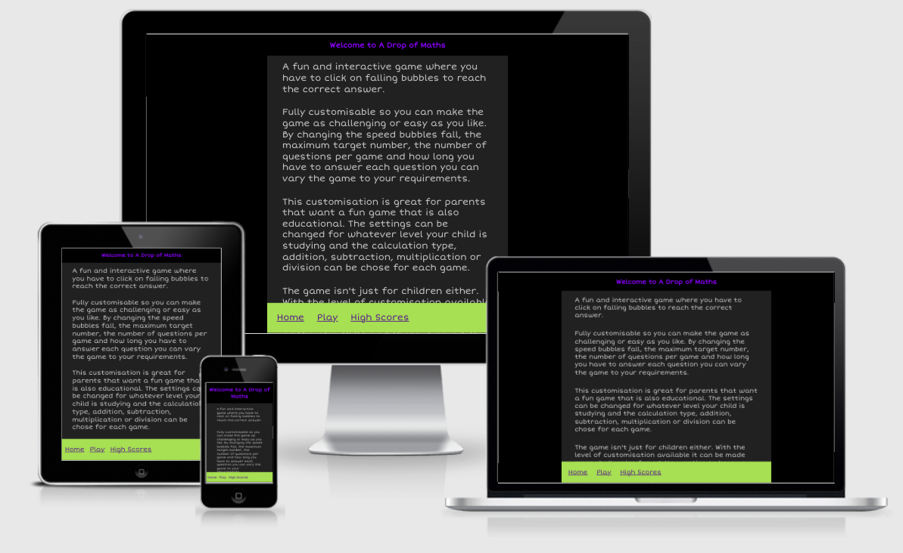
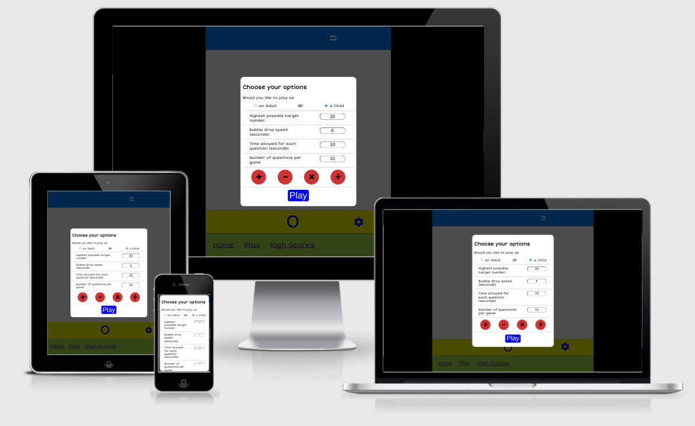
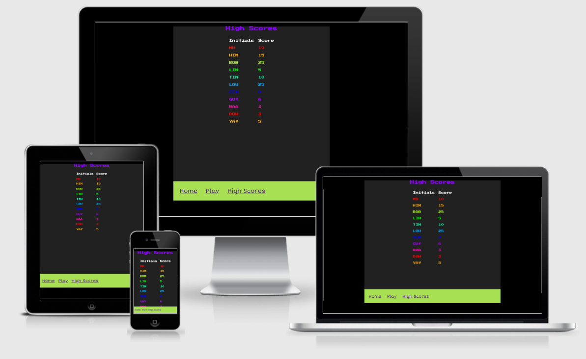

# A Drop of Maths
[A Drop of Maths](https://martinbannister.github.io/CI_MS2_aDropOfMaths/) is a mathematical game for people of all ages to enjoy and improve or maintain their mental arithmetic skills.  

The game has been designed to be both fun and challenging whatever your still level and game settings can be customised to change the level of difficulty.  There is even a choice of game theme for children or adults.  The theme for children is more bright and colourful and the theme for adults is largely monochromatic based on variations of the same blue colour.  The theme is purely cosmetic as the game settings determine the difficulty.

If you would like to have a go yourself and challenege your mental artihmetic skills **_A Drop of Maths_** can be found at [https://martinbannister.github.io/CI_MS2_aDropOfMaths/](https://martinbannister.github.io/CI_MS2_aDropOfMaths/).

## Table of Contents
---
1. [Project Goals](#project-goals)

2. [User Experience](#user-experience)
    1. [Target Audience](#target-audience)
    2. [User Stories](#user-stories)
        1. [First Time Visitors](#first-time-visitors)
        2. [Returning Visitors](#returning-visitors)
        3. [Hotel Owner](#hotel-owner)
3. [Scope](#scope)
    1. [Design](#design)
    2. [Colour Scheme](#colour-scheme)
    3. [Typography](#typeography)
    4. [Images](#images)
4. [Wireframes](#wireframes)
5. [Features](#features)
6. [Technologies Used](#technologies-used)
7. [Testing](#testing)
    - [Bugs During Development](#Bugs-found-and-resolved-during-development)
8. [Deployment](#deployment)
9. [Credits](#credits)
10. [Acknowledgements](#acknowledgements)

## Project Goals
---
The goals of the project are the same for all stakeholders.  

### For players
To have fun whilst improving their mental arithmetic skills.

### For the site creator
To create a fun and challenging game that they can enjoy as well as their site visitors.

[Back to Index](#table-of-contents)

## User Experience
---
The author designed the site so that the game can be played on a veriety of devices and screeen sizes.  The author's goal was to create a game that was both fun and educational and could be played by both children and adults.  This is achieved through customisation options that allow the parameters of the game to be changed by the player and includes separate colour themes for children and adults.

The children's theme is the default because the author wanted the least amount of friction to children playing and enjoying the game.

### Target Audience
- 
### User Stories

#### First Time Visitors

##### Parents
As a parent:
1. I want a game that is easy to play and understand.
2. I want a game that I can customise to my child's level of ability.
3. I want my children to play a game that is educational.
4. I want my children to be able to play a game that is safe.
5. I want my children to be engaged and have fun.
6. I wany my children to feel a sense of achievement.

[Back to Index](#table-of-contents)

##### Adults
7. I want to improve my mental artihmatic skills.
8. I want to be able to play the game quickly.
9. I want to feel like I am playing something serious and not silly.
10. I want the game to be available across all my devices.
11. I want to be able to save my progress.

[Back to Index](#table-of-contents)

#### Returning Visitors
12. I want to see my previous scores.
13. I want to be able to change settings to make the game more challenging.

[Back to Index](#table-of-contents)

## Scope

## Design

### Colour Scheme
I have chosen the ability to select from two colour schemes for the game.  One is a more somber less garish colour pallet targeted at adults.  The other is a more bright a colourful pallet that should appeal more to children.  

The reason for this is that I wanted the game to be accessibly to people of all ages; a game parents could let their children play to improve their maths skills and a game that adults can play to improve their day to day mental arithmatic. 

Just having the one child-like colour pallet could put off adult players.

### Typography
I chose the short stack font for it's readable quality and because it reflects characters that are rendered in a more hand written way than traditional typography.  This should make it more readable and accessible for children.

I chose Schoolbell because it has a more childlike, handwriten quality but is less readable.  As such it's use has been limited to in-game pop up messages such as, correct, try again and you won.

I chose the "Press Start 2P" font for the high scores page because it has an 8 bit retro feel.  I wanted to recreate an arcade style high score page and this fits perfectly.

For the adult theme I have chosen to use the Ariel font throughout to keep the theme more serious looking.

All fonts are served from [Google Fonts](https://fonts.google.com/)

### Images
No images have been used in the creation of the game.

## Wireframes
### Desktop
[Index]()

### Tablet

### Mobile

## Features
### Current Features
1. 

**User stories covered by this feature**

[Navigation on all sizes](docs/user_story_images/nav_on_all_sizes.png)

2. 

**User stories covered by this feature**

[Footer on all pages](docs/user_story_images/footer_with_book_all_pages.png)

3. 

**User stories covered by this feature**

[Footer on all pages](docs/user_story_images/footer_with_book_all_pages.png)

4. 

**User stories covered by this feature**

[Hope Page Features](docs/user_story_images/home_page_features.png)

5. 

**User stories covered by this feature**

6. 

**User stories covered by this feature**

7. 

**User stories covered by this feature**

[Contact page](docs/user_story_images/contact_page.png)

### Future Features
Below is a list of features I would like to implement in the future.

- 

## Technologies Used

### Languages
- [HTML5](https://en.wikipedia.org/wiki/CSS)
- [CSS3](https://en.wikipedia.org/wiki/CSS)
- [Javascript](https://en.wikipedia.org/wiki/JavaScript)

### Frameworks, libraries and other tools

[Google Fonts](https://fonts.google.com/) Site fonts

[Am I responsive](http://ami.responsivedesign.is/)

[Unicode Table](https://unicode-table.com/en/sets/)

## Testing

### HTML Validation
I used the [W3C Markup Validation Service](https://validator.w3.org/) to validate the HTML of all the pages on the site. Initially the pages showed some errors and these were corrected.

Links to the inial report and the final result with no errors are in the table below.

- [index.html]() 

- 

-  

- 

- [404.html]()

[Back to Index](#table-of-contents)

### CSS Validation
I used the [W3C CSS Validation Service](http://jigsaw.w3.org/css-validator/validator) to validate my style.css file of the site.

The CSS passed first time with [zero errors](docs/validation/css/W3C_CSS_Validation.png).

[Back to Index](#table-of-contents)

### Accessibility
I used the [WAVE WebAIM web accessibility evaluation tool]() to check that there we no issues with accessibility standards.  

All pages pass without errors except for about.html.

Click on the links to see each report:

- [Wave index.html]()

- [Wave ]()

- [Wave ]()

- [Wave ]()

- [Wave 404.html]()

[Back to Index](#table-of-contents)

### Performance

[Google Lighthouse](https://developers.google.com/web/tools/lighthouse/) 

- [Lighthouse index.html]()

- [Lighthouse ]()

- [Lighthouse ]()

- [Lighthouse ]()

- [Lighthouse 404.html]()

[Back to Index](#table-of-contents)

### Tests on Various Devices

#### Devices Tested
- Honor 10 (Chrome & Firefox)
- Honor Play
- Lenovo Thinkpad C13 Yoga (Chrome & Firefox)
- iPhone XS Max

#### Tests Performed

#### Results

### Browser Compatibility
- Google Chrome
- Mozilla Firefox

### Testing User Stories

## Bugs found and resolved during development

- 
    - Fix: 

- 
    - Fix: 

- 
    - Fix: 

## Deployment

### GitHub Pages
I have used GitHub pages to deploy this page.  If you would like to do the same you can follow these steps:

1. Log into your GitHub account and find the [repository](). 
2. Click on 'Settings' in the repository. 
3. Click 'Pages' in the left-hand menu once you're in Settings. 
4. Click 'Source'.
5. Click the dropdown menu which says 'None', then select 'Master Branch'.
6. Wait for page to refresh automatically. 
7. Under GitHub pages you can now find a link to the published live website. 

### Forking the GitHub Repository
If you would like to fork this respository so you can make changes without affecting the original please follow these steps:

1. Log into your GitHub account and find the [repository]().
2. Click 'Fork' (last button on the top right of the repository page).
3. You will then have a copy of the repository in your own GitHub account. 

### Making a Local Clone
In order to make a clone of this repository to work on locally, follow these steps:

1. Log into your GitHub account and find the [repository]().
2. Click on the 'Code' button (next to 'Add file'). 
3. To clone the repository using HTTPS, under clone with HTTPS, copy the link.
4. Then open Git Bash.
5. Change the current working directory to where you want the cloned directory to be made.
6. In your IDE's terminal type 'git clone' followed by the URL you copied.
7. Press Enter. 
8. Your local clone will now be made.

## Credits
*All credits included in code where applicable*

### Code references
#### 1. **Credit Title** - For [Feature](https://addressofreference.com)

#### 2. **Stack Overflow** - [default select option as blank - Stack Overflow](https://stackoverflow.com/questions/8605516/default-select-option-as-blank)

### Media

### Acknowledgements