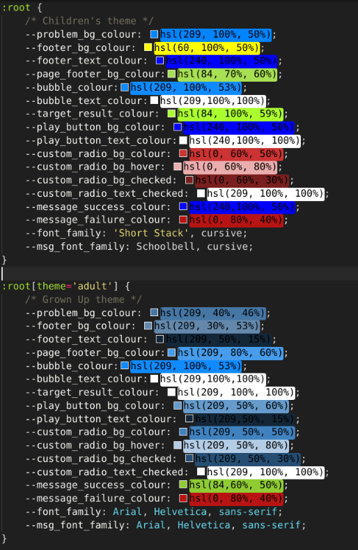

# A Drop of Maths
[A Drop of Maths](https://martinbannister.github.io/CI_MS2_aDropOfMaths/) is a mathematical game for people of all ages to enjoy and improve or maintain their mental arithmetic skills.  

The game has been designed to be both fun and challenging whatever your still level and game settings can be customised to change the level of difficulty.  There is even a choice of game theme for children or adults.  The theme for children is more bright and colourful and the theme for adults is largely monochromatic based on variations of the same blue colour.  The theme is purely cosmetic as the game settings determine the difficulty.

If you would like to have a go yourself and challenege your mental artihmetic skills **_A Drop of Maths_** can be found at [https://martinbannister.github.io/CI_MS2_aDropOfMaths/](https://martinbannister.github.io/CI_MS2_aDropOfMaths/).

## Table of Contents
---
1. [Project Goals](#project-goals)

2. [User Experience](#user-experience)
    1. [Target Audience](#target-audience)
    2. [User Stories](#user-stories)
        1. [First Time Visitors](#first-time-visitors)
        2. [Returning Visitors](#returning-visitors)
        3. [Hotel Owner](#hotel-owner)
3. [Scope](#scope)
    1. [Design](#design)
    2. [Colour Scheme](#colour-scheme)
    3. [Typography](#typeography)
    4. [Images](#images)
4. [Wireframes](#wireframes)
5. [Features](#features)
6. [Technologies Used](#technologies-used)
7. [Testing](#testing)
    - [Bugs During Development](#Bugs-found-and-resolved-during-development)
8. [Deployment](#deployment)
9. [Credits](#credits)
10. [Acknowledgements](#acknowledgements)

## Project Goals
---
The goals of the project are the same for all stakeholders.  

### For players
To have fun whilst improving their mental arithmetic skills.

### For the site creator
To create a fun and challenging game that they can enjoy as well as their site visitors.

[Back to Index](#table-of-contents)

## User Experience
---
The author designed the site so that the game can be played on a veriety of devices and screeen sizes.  The author's goal was to create a game that was both fun and educational and could be played by both children and adults.  This is achieved through customisation options that allow the parameters of the game to be changed by the player and includes separate colour themes for children and adults.

The children's theme is the default because the author wanted the least amount of friction to children playing and enjoying the game.

### Target Audience
- 
### User Stories

#### First Time Visitors

##### Parents
As a parent:
1. I want a game that is easy to play and understand.
2. I want a game that I can customise to my child's level of ability.
3. I want my children to play a game that is educational.
4. I want my children to be able to play a game that is safe.
5. I want my children to be engaged and have fun.
6. I wany my children to feel a sense of achievement.

[Back to Index](#table-of-contents)

##### Adults
7. I want to improve my mental artihmatic skills.
8. I want to be able to play the game quickly.
9. I want to feel like I am playing something serious and not silly.
10. I want the game to be available across all my devices.
11. I want to be able to save my progress.

[Back to Index](#table-of-contents)

#### Returning Visitors
12. I want to see my previous scores.
13. I want to be able to change settings to make the game more challenging.

[Back to Index](#table-of-contents)

## Scope

## Design

### Colour Scheme
I have chosen the ability to select from two colour schemes for the game.  One is a more somber less garish colour pallet targeted at adults.  The other is a more bright a colourful pallet that should appeal more to children.  

The reason for this is that I wanted the game to be accessibly to people of all ages; a game parents could let their children play to improve their maths skills and a game that adults can play to improve their day to day mental arithmatic. 

Just having the one child-like colour pallet could put off adult players.

Below are the two colour schemes taken from the CSS file. As you will see the children's theme uses more of a wide range of bright colurs, where as the adult theme is largely based around shades of the same colour.  

Although a bubble colour is specified for the children's theme for finctionality reasons the actual bubble colours are varied when created to make the experience more colourful and engaging.  The bubble colour when using the adult theme remanins static for each bubble.

### Typography
The author chose the short stack font for it's readable quality and because it reflects characters that are rendered in a more hand written way than traditional typography.  This should make it more readable and accessible for children.

The author chose Schoolbell because it has a more childlike, handwriten quality but is less readable.  As such it's use has been limited to in-game pop up messages such as, correct, try again and you won.

The author chose the "Press Start 2P" font for the high scores page because it has an 8 bit retro feel.  The author wanted to recreate an arcade style high score page and this fits perfectly.

For the adult theme The author has chosen to use the Ariel font throughout to keep the theme more serious looking.

The Material Icons font is used for the settings button icon.

All fonts are served from [Google Fonts](https://fonts.google.com/)

### Images
No images have been used in the creation of the game.

## Wireframes
You will notice the wireframes differ somewhat from the final game.  This is because the original game was intended to be a single page with an introduction to the game.

With the inclusion of a home page and high scores page the design was adapted to suit this and have some consistenet layout across pages.

Rather than tabs the selection of the calculation type is done in the settings screen before the game starts.

There are no mock ups of the home page or high scores page as these were added after the design stage.

### Desktop
[Intro 1](assets/docs/wireframes/01_wireframe_desktop_start_1.pdf)

[Intro 2](assets/docs/wireframes/02_wireframe_desktop_start_2.pdf)

[Intro 3](assets/docs/wireframes/03_wireframe_desktop_start_3.pdf)

[Settings](assets/docs/wireframes/04_wireframe_desktop_settings.pdf)

[Addition](assets/docs/wireframes/05_wireframe_desktop_plus.pdf)

[Subtraction](assets/docs/wireframes/06_wireframe_desktop_minus.pdf)

[Multiplication](assets/docs/wireframes/07_wireframe_desktop_times.pdf)

[Division](assets/docs/wireframes/08_wireframe_desktop_divide.pdf)

## Features
### Current Features
1. Customisable game settings are presented at the beginning of the game.  Users can choose the theme and various settings to alter difficulty and select the calculation type.

**User stories covered by this feature**
2, 7

2. Selectable colour scheme for Adult or Child.

**User stories covered by this feature**
5, 9

3. 

**User stories covered by this feature**

4. 

**User stories covered by this feature**

5. 

**User stories covered by this feature**

6. 

**User stories covered by this feature**

7. 

**User stories covered by this feature**

### Future Features
Below is a list of features I would like to implement in the future.

- Explosion effect on bubble click
- A continuous mode to keep playing until you get an answer wrong
- A random operator option to vary calculation types throughout play

## Technologies Used

### Languages
- [HTML5](https://en.wikipedia.org/wiki/CSS)
- [CSS3](https://en.wikipedia.org/wiki/CSS)
- [Javascript](https://en.wikipedia.org/wiki/JavaScript)

### Frameworks, libraries and other tools

[Google Fonts](https://fonts.google.com/) Site fonts

[Am I responsive](http://ami.responsivedesign.is/)

[Unicode Table](https://unicode-table.com/en/sets/)

### APIs

[Sheets DB](https://sheetdb.io/)

[Google Sheets API](https://developers.google.com/sheets/api/reference/rest)

## Testing

Testing is documented in the [testing.md](assets/docs/testing.md) file.

[Back to Index](#table-of-contents)

## Deployment

### GitHub Pages
I have used GitHub pages to deploy this page.  If you would like to do the same you can follow these steps:

1. Log into your GitHub account and find the [repository](https://martinbannister.github.io/CI_MS2_aDropOfMaths/). 
2. Click on 'Settings' in the repository. 
3. Click 'Pages' in the left-hand menu once you're in Settings. 
4. Click 'Source'.
5. Click the dropdown menu which says 'None', then select 'Master Branch'.
6. Wait for page to refresh automatically. 
7. Under GitHub pages you can now find a link to the published live website. 

### Forking the GitHub Repository
If you would like to fork this respository so you can make changes without affecting the original please follow these steps:

1. Log into your GitHub account and find the [repository](https://martinbannister.github.io/CI_MS2_aDropOfMaths/).
2. Click 'Fork' (last button on the top right of the repository page).
3. You will then have a copy of the repository in your own GitHub account. 

### Making a Local Clone
In order to make a clone of this repository to work on locally, follow these steps:

1. Log into your GitHub account and find the [repository](https://martinbannister.github.io/CI_MS2_aDropOfMaths/).
2. Click on the 'Code' button (next to 'Add file'). 
3. To clone the repository using HTTPS, under clone with HTTPS, copy the link.
4. Then open Git Bash.
5. Change the current working directory to where you want the cloned directory to be made.
6. In your IDE's terminal type 'git clone' followed by the URL you copied.
7. Press Enter. 
8. Your local clone will now be made.

## Credits
*All credits included in code where applicable*

### Code references

#### 1. **How to layout divs**

[https://coder-coder.com/display-divs-side-by-side/](https://coder-coder.com/display-divs-side-by-side/)

[https://www.w3schools.com/css/css_grid.asp](https://www.w3schools.com/css/css_grid.asp)

#### 2. **Linear gradients for logo text**

[https://cssgradient.io/blog/css-gradient-text/](https://cssgradient.io/blog/css-gradient-text/)

[https://developer.mozilla.org/en-US/docs/Web/CSS/gradient/linear-gradient()](https://developer.mozilla.org/en-US/docs/Web/CSS/gradient/linear-gradient())

#### 3. **Opposite colour using HSL**

[https://stackoverflow.com/questions/44912849/find-the-opposite-of-a-direction-angle-360-degrees-in-javascript/44912872](https://stackoverflow.com/questions/44912849/find-the-opposite-of-a-direction-angle-360-degrees-in-javascript/44912872)

#### 4. **Using CSS variables to make themes**

[https://www.sitepoint.com/css-theming-custom-properties-javascript/](https://www.sitepoint.com/css-theming-custom-properties-javascript/)

#### 5. **Create custom radio buttons**

[https://www.w3schools.com/howto/howto_css_custom_checkbox.asp](https://www.w3schools.com/howto/howto_css_custom_checkbox.asp)

#### 6. **Update CSS Variables from JS**

[https://css-tricks.com/updating-a-css-variable-with-javascript/](https://css-tricks.com/updating-a-css-variable-with-javascript/)

#### 7. **Clearing all child elements**

[https://stackoverflow.com/questions/3955229/remove-all-child-elements-of-a-dom-node-in-javascript#answer-65413839](https://stackoverflow.com/questions/3955229/remove-all-child-elements-of-a-dom-node-in-javascript#answer-65413839)

### Acknowledgements